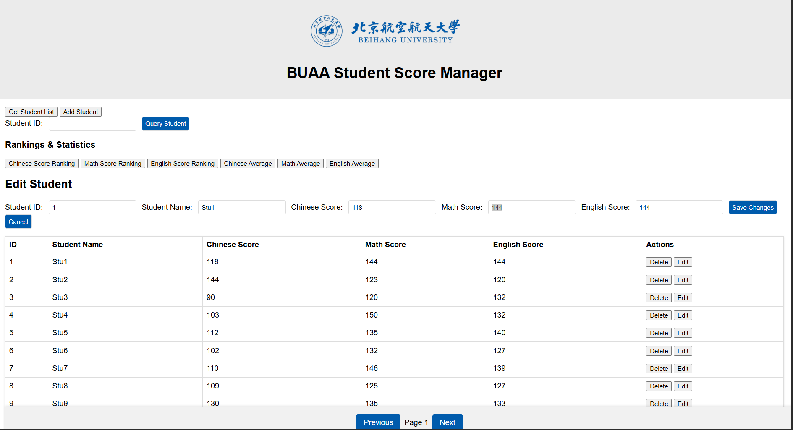
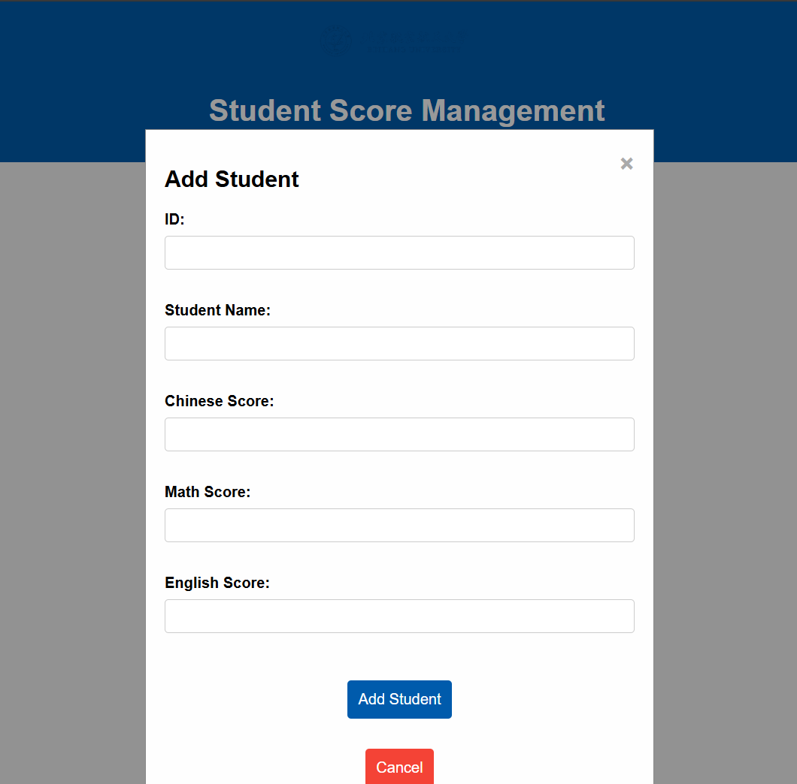
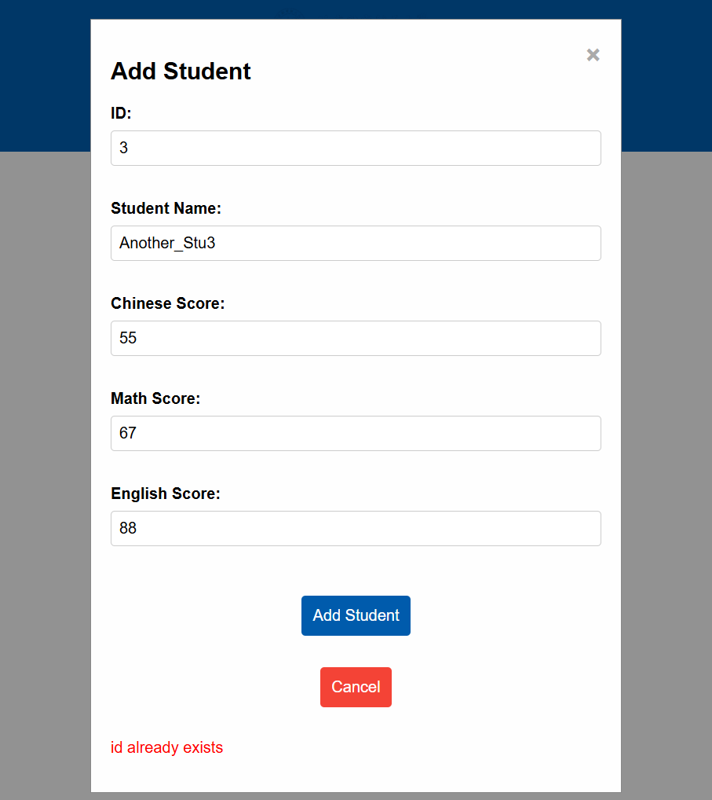

# BUAA 学生成绩管理系统

**本项目使用Trae编辑器开发，内容中有AI生成部分**

## 🎓 项目概述

BUAA 学生成绩管理系统是一个基于 WebService 技术的学生信息管理系统，采用前后端分离架构，使用 XML+SOAP 协议进行数据通信。本项目是北京航空航天大学《互联网软件新技术（XML和Web）》课程的作业作品，具有美观的界面设计和完善的功能实现。

## ✨ 项目特色

- **现代化界面**：响应式设计，用户体验友好
- **WebService 架构**：基于 SOAP 协议的 XML 数据交换
- **前后端分离**：客户端与服务器端独立部署，便于维护扩展
- **数据可视化**：支持成绩排名、平均分统计等数据分析功能

## 🚀 主要功能

### 📊 学生管理

- **学生列表展示**：分页显示所有学生信息
- **添加学生**：录入新学生的基本信息和成绩
- **编辑学生**：修改现有学生的个人信息和成绩
- **删除学生**：移除不需要的学生记录
- **查询学生**：按学号精确查找特定学生

### 📈 成绩分析

- **成绩排名**：按单科成绩进行排名展示
- **平均分统计**：计算各科目的平均分数
- **成绩对比**：支持多维度成绩数据分析

### 🔍 智能搜索

- **学号查询**：快速定位特定学生
- **分页浏览**：优化大数据量展示性能

## 🛠️ 技术架构

### 前端技术

- **HTML5 + CSS3**：现代化页面布局与样式
- **JavaScript**：动态交互与数据处理
- **Flask**：轻量级 Python Web 框架
- **AJAX**：异步数据交互，提升用户体验

### 后端技术

- **Python 3.10**：强大的后端开发语言
- **Spyne**：专业的 WebService 框架
- **SOAP 协议**：基于 XML 的标准化通信协议
- **SQLite**：轻量级关系型数据库

### 数据格式

- **XML**：标准化的数据交换格式
- **JSON**：前后端数据传输格式
- **SOAP**：WebService 通信协议

## 📦 项目结构

``` bash
BUAA-StuManager/
├── client/                    # 前端应用
│   ├── app.py                # Flask 前端服务器
│   ├── static/               # 静态资源
│   │   ├── index_style.css   # 主页面样式
│   │   ├── add_user_style.css # 添加用户页面样式
│   │   └── logo.png          # 北航校徽图标
│   ├── templates/            # HTML 模板
│   │   ├── index.html        # 主页面
│   │   └── add_student.html  # 添加学生页面
│   └── test_client.py        # 客户端测试脚本
├── server/                    # 后端服务
│   ├── service.py            # WebService 服务端
├── model/                     # 数据模型
│   └── model.py              # 用户模型定义
├── main.py                    # 项目启动器
└── students.db                   # 主数据库文件
```

## 🚦 快速开始

### 环境要求

- Python 3.10 或更高版本
- pip 包管理器

### 安装依赖

```bash
# 克隆项目
git clone https://github.com/Roy-GY/BUAA-StuManager.git
cd BUAA-StuManager

# 安装依赖包（建议创建虚拟环境）
pip install flask spyne lxml requests
```

### 启动项目

```bash
# 方式一：使用主启动器（推荐）
python main.py

# 方式二：分别启动前后端
# 启动后端服务（端口 9567）
python server/service.py

# 启动前端应用（端口 5000）
python client/app.py
```

### 访问应用

- **主应用**：http://localhost:5000

## 🎨 界面展示

### 主界面


*图1：学生列表主界面*

### 编辑功能


*图2：学生信息编辑界面*

### 添加学生


*图3：添加新学生界面*

### 错误处理


*图4：学号重复时的错误提示*

## 📡 WebService 示例

### 成功添加学生

```xml
<?xml version='1.0' encoding='UTF-8'?>
<soap11env:Envelope xmlns:soap11env="http://schemas.xmlsoap.org/soap/envelope/" xmlns:tns="PyWebService2">
    <soap11env:Body>
        <tns:add_studentResponse>
            <tns:add_studentResult>{
                "id": 26,
                "student_name": "张三",
                "chinese_score": 95,
                "math_score": 98,
                "english_score": 92
            }</tns:add_studentResult>
        </tns:add_studentResponse>
    </soap11env:Body>
</soap11env:Envelope>
```

### 添加失败（学号已存在）

```xml
<?xml version='1.0' encoding='UTF-8'?>
<soap11env:Envelope xmlns:soap11env="http://schemas.xmlsoap.org/soap/envelope/" xmlns:tns="PyWebService2">
    <soap11env:Body>
        <tns:add_studentResponse>
            <tns:add_studentResult>{
                "error": "id already exists"
            }</tns:add_studentResult>
        </tns:add_studentResponse>
    </soap11env:Body>
</soap11env:Envelope>
```

## 👨‍💻 作者信息

**吴承儒** (23230618)

- 北京航空航天大学
- 沈元学院
- 项目完成时间：2025年11月

⭐ 如果这个项目对您有帮助，欢迎给个 Star！
